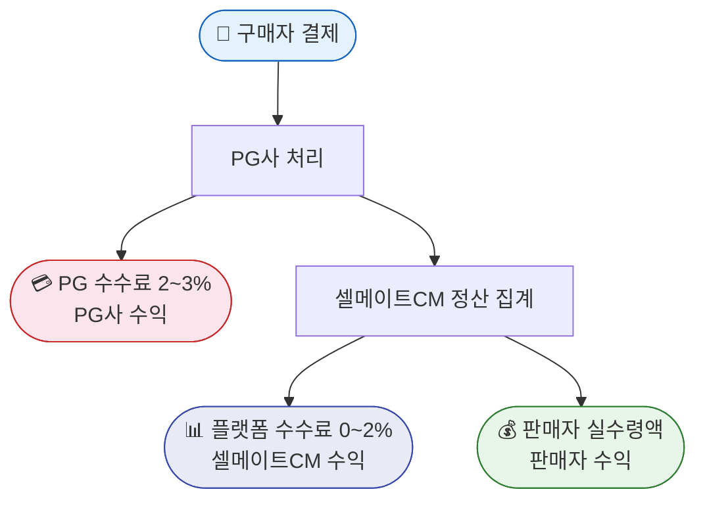

# 셀메이트CM 전략 프레임워크 기반 기획안 분석 [4]

> 작성일: 2026-03-10 | 버전: v0.1
> 기반 문서: product-plan.md, business-roadmap.md, pricing-model.md, 전체 research/ 폴더

---

## 목차

1. [전략 프레임워크 선택 근거](#1-전략-프레임워크-선택-근거)
2. [SWOT 분석](#2-swot-분석)
3. [Porter's 5 Forces](#3-porters-5-forces)
4. [Lean Canvas](#4-lean-canvas)
5. [3C 분석](#5-3c-분석)
6. [포지셔닝 맵](#6-포지셔닝-맵)
7. [수익 구조 다이어그램](#7-수익-구조-다이어그램)
8. [기존 전략 문서와의 상충점 및 보완 사항](#8-기존-전략-문서와의-상충점-및-보완-사항)
9. [핵심 인사이트 및 우선 과제](#9-핵심-인사이트-및-우선-과제)

---

## 1. 전략 프레임워크 선택 근거

셀메이트CM는 **플랫폼 비즈니스 초기 스타트업**으로, 다음 프레임워크 조합이 가장 적합하다.

| 프레임워크 | 적용 이유 |
|-----------|---------|
| **SWOT** | 내부 역량과 외부 환경을 4분면으로 빠르게 정리. 전략 방향 전반 점검 |
| **Porter's 5 Forces** | 경쟁 구도와 구조적 힘의 균형 분석. B2B SaaS 시장 진입 장벽 평가에 효과적 |
| **Lean Canvas** | 스타트업 초기 가설 구조화. 문제-해결책-채널-수익 흐름을 한 페이지에 압축 |
| **3C 분석** | 고객(Customer)·경쟁사(Competitor)·자사(Company) 삼각 구도 명확화 |
| **포지셔닝 맵** | 카페24/Shopify/BASE 대비 셀메이트CM의 시장 위치 시각화 |

---

## 2. SWOT 분석

### 내부 강점 (Strengths)

| 강점 | 설명 | 근거 |
|------|------|------|
| **PG 파트너십 선확보** | 이니시스(한국·일본), 토스페이먼츠, 엑심베이, PayPal multiparty 계약 완료. 수수료 수익 구조 구축 | jp-payment-native.md |
| **한국 결제 네이티브** | 카카오페이·네이버페이·토스·가상계좌 기본 탑재. Shopify 미지원 영역 | pg-stripe-support.md |
| **일본 로컬라이제이션** | 콘비니·PayPay·인보이스 제도 자동화. Shopify+komoju보다 통합적 | shopify-jp-payment-ux.md |
| **통합 결제 대시보드** | 모든 PG 정산 단일 뷰. Shopify의 분리 대시보드 문제 해결 | spec/unified-payment-dashboard.md |
| **AI-First 온보딩** | 30분 셋업 목표. 카페24의 복잡한 초기 설정 대비 마찰 최소화 | product-plan.md |
| **슬라이딩 마진 모델** | 월 500만 원까지 0% 수수료. 소규모 판매자 진입 장벽 제거 | pricing-model.md |
| **헤드리스 아키텍처** | 디자인 에이전시 자유 구성. 카페24의 제한적 디자인 자유도 대비 차별화 | product-plan.md |

### 내부 약점 (Weaknesses)

| 약점 | 설명 | 대응 방향 |
|------|------|---------|
| **브랜드 인지도 제로** | 신규 플랫폼. 카페24(200만 스토어)·Shopify(480만 스토어) 대비 신뢰도 부재 | 얼리어답터 레퍼런스 우선 확보 |
| **초기 앱 생태계 부재** | 써드파티 앱 없음. 카페24 6,000개+ 앱 대비 선택지 제한 | 핵심 기능 내재화로 보완 |
| **PG 제휴 심사 기간** | GMO-PG 심사 2~3개월. 일본 런칭 시점 위협 가능성 | 3월 착수 필수 (크리티컬 패스) |
| **운영 자원 제약** | 웹프론트엔드 2명·백엔드 2명·Flutter 앱 2명·디자이너 1명·PM 1명·사업 1명(유림). 총 9명, AI 도구 활용으로 프론트·백·앱 경계를 넘나드는 유연한 업무 배분 운영 → 대형 엔터프라이즈 전담 지원은 어려움 | Self-serve 중심 집중 |
| **일본 직영 법인 부재** | 셀메이트 일본 법인이 존재하나 스마트폰 결제 등 셀메이트CM 브랜드 직접 계약은 별도 필요. 단기 제약 | 셀메이트 일본 법인 활용 우선, 셀메이트CM 자체 계약은 Phase 2 로드맵 수립 |

### 외부 기회 (Opportunities)

| 기회 | 규모 | 근거 |
|------|------|------|
| **카페24 이탈 니즈** | 카페24 200만 스토어 중 글로벌 진출 니즈 잠재 | korea-ecommerce-platforms.md |
| **일본 독립몰 성장** | Shopify JP 스토어 도쿄 단독 18,142개, YoY +16% | japan-korea-ecommerce.md |
| **일본 D2C 전환 공식** | 라쿠텐·아마존 입점 후 자사몰 전환 트렌드 정착 | japan-gtm.md |
| **AI 이커머스 시장 성장** | AI 패션 시장 연 39.8% 성장. AI 도구에 대한 수요 증가 | fashion-ecommerce-features.md |
| **동남아 D2C 수요 형성** | GMV $1,280억 고성장 시장, 마켓플레이스 의존 탈피 수요 | global-market-overview.md |
| **Shopify의 일본 현지화 공백** | 콘비니·인보이스·착불 등 미해결 영역 | shopify-jp-payment-ux.md |

### 외부 위협 (Threats)

| 위협 | 심각도 | 대응 방향 |
|------|--------|---------|
| **Shopify의 일본 투자 강화** | 높음 | 2025년 Mitsui 파트너십·PayPay 연동 등 빠른 추격. 선점 속도 높여야 |
| **카페24의 일본 진출 강화** | 중간 | KG이니시스 제휴로 일본 결제 진출. 차별화 포인트 명확히 |
| **BASE/STORES의 성장** | 중간 | 일본 로컬 플랫폼. 단, 글로벌 확장성 부재 — 차별화 유지 |
| **PG 심사 지연** | 높음 | 6월 런칭 일정 위협. 3월 착수 + 백업 PG 병행 준비 |
| **AI 기반 노코드 경쟁** | 낮음 | Wix·Squarespace의 AI 강화. 단, 아시아 최적화는 여전히 공백 |

---

## 3. Porter's 5 Forces

### 3.1 신규 진입자 위협 (Threat of New Entrants): 🟡 중간

```
진입 장벽:
+ PG사 제휴 심사: 국내외 PG사와의 계약에 수개월 소요 → 모방 어려움
+ 현지화 깊이: 일본 소비세·콘비니 등 도메인 지식 축적에 시간 필요
+ 네트워크 효과: 판매자 수 ↑ → 레퍼런스 ↑ → 신규 판매자 유입

진입 용이:
- Shopify처럼 범용 플랫폼 + 앱으로 동일 기능 구현 가능
- AI 도구로 개발 속도 가속 → 진입 비용 하락 추세
```

**결론**: 단기 진입 장벽은 중간 수준. 장기적으로 판매자 기반과 PG 네트워크 확보가 핵심 해자.

### 3.2 대체재 위협 (Threat of Substitutes): 🔴 높음

주요 대체재:
- **Shopify**: 글로벌 표준. 일본 현지화 개선 중
- **카페24**: 한국 시장 지배적. 글로벌 기능 보완 중
- **BASE/STORES**: 일본 시장 저비용 대안
- **WooCommerce**: 오픈소스 자체 구축
- **노코드 (Wix, Webflow)**: 소규모 스토어 대안

**결론**: 대체재 위협 높음. 셀메이트CM만의 독점적 가치(아시아 크로스보더 통합 + 현지화 깊이)로 차별화 필수.

### 3.3 구매자 교섭력 (Bargaining Power of Buyers): 🟡 중간

- 중소 판매자(SMB): 교섭력 낮음 (대안이 있어도 전환 비용 발생)
- 대형 엔터프라이즈: 교섭력 높음 (커스텀 계약, SLA 요구)
- 판매자 집중도: 분산 → 개별 교섭력 제한적

**결론**: SMB 중심 전략 시 구매자 교섭력 관리 가능. Enterprise 계약은 별도 협상 구조.

### 3.4 공급자 교섭력 (Bargaining Power of Suppliers): 🟡 중간

주요 공급자: PG사 (KG이니시스, 토스페이먼츠, GMO-PG), 클라우드 (AWS/Azure)

- PG사: 대안 존재하나 심사 기간 및 계약 조건 협상이 필수. GMV 낮을 때 협상력 약함
- 클라우드: AWS/Azure 경쟁 → 낮은 교섭력 (전환 가능)

**결론**: 초기 GMV 낮을 때 PG사 조건이 불리할 수 있음. GMV 성장 후 재협상 플랜 필요.

### 3.5 기존 경쟁자 경쟁 강도 (Competitive Rivalry): 🔴 높음

- Shopify: 글로벌 1위, 자원 압도적
- 카페24: 한국 1위, 방어적 전략
- BASE/STORES: 일본 로컬 강자

**결론**: 정면 경쟁보다 **틈새 포지셔닝** (카페24도 Shopify도 아닌 '아시아 크로스보더 특화')이 생존 전략.

---

## 4. Lean Canvas

<div style="overflow-x:auto;">
<table style="width:100%;border-collapse:collapse;font-size:0.875em;min-width:680px;">
  <tr>
    <td rowspan="2" style="border:2px solid #5c6bc0;padding:14px 12px;vertical-align:top;width:20%;background:#fafafa;">
      <strong style="color:#c62828;">🔴 문제</strong><br><br>
      1. 카페24는 글로벌 진출 어려움<br><br>
      2. Shopify는 일본 현지화 미흡<br><br>
      3. 크로스보더 정산이 복잡함
    </td>
    <td style="border:2px solid #5c6bc0;padding:14px 12px;vertical-align:top;width:20%;background:#fafafa;">
      <strong style="color:#2e7d32;">✅ 해결책</strong><br><br>
      1. 한국 결제 네이티브 + 글로벌 크로스보더 통합<br><br>
      2. 일본 로컬라이제이션 내장<br>(콘비니·PayPay·인보이스)<br><br>
      3. 통합 정산 대시보드<br><br>
      4. AI 30분 온보딩<br><br>
      5. 슬라이딩 수수료 (0~2%)
    </td>
    <td rowspan="2" style="border:2px solid #5c6bc0;padding:14px 12px;vertical-align:top;width:20%;background:#e8eaf6;">
      <strong style="color:#3949ab;">⭐ 핵심 가치 제안</strong><br><br>
      <em>"카페24도 Shopify도<br>아닌 제3의 선택"</em><br><br>
      · 한국에서 시작해 일본·동남아까지 하나의 플랫폼으로<br><br>
      · 월 500만 원까지 수수료 0%<br><br>
      · 글로벌 결제 기본 탑재
    </td>
    <td style="border:2px solid #5c6bc0;padding:14px 12px;vertical-align:top;width:20%;background:#fafafa;">
      <strong style="color:#e65100;">🏆 불공정한 이점</strong><br><br>
      · 아시아 결제 도메인 지식<br><br>
      · StoreX 기존 고객 기반<br><br>
      · 셀메이트의 일본 이커머스 네트워크
    </td>
    <td rowspan="2" style="border:2px solid #5c6bc0;padding:14px 12px;vertical-align:top;width:20%;background:#fafafa;">
      <strong style="color:#5c6bc0;">👥 고객 세그먼트</strong><br><br>
      1. 카페24 불만 판매자<br>(글로벌 진출 준비)<br><br>
      2. 일본 라쿠텐·아마존<br>자사몰 전환 희망 셀러<br><br>
      3. K-뷰티·K-패션<br>일본 직출 브랜드
    </td>
  </tr>
  <tr>
    <td style="border:2px solid #5c6bc0;padding:14px 12px;vertical-align:top;background:#fafafa;">
      <strong style="color:#5c6bc0;">📊 핵심 지표</strong><br><br>
      · 활성 판매자 수<br><br>
      · 월 총 GMV<br><br>
      · 판매자 이탈율
    </td>
    <td style="border:2px solid #5c6bc0;padding:14px 12px;vertical-align:top;background:#fafafa;">
      <strong style="color:#5c6bc0;">📣 채널</strong><br><br>
      1. 직접 아웃리치<br>(커뮤니티, DM)<br><br>
      2. GMO-PG·에이전시 파트너십<br><br>
      3. 이커머스 커뮤니티<br><br>
      4. 웨비나·세미나
    </td>
  </tr>
  <tr>
    <td colspan="2" style="border:2px solid #5c6bc0;padding:14px 12px;vertical-align:top;background:#fafafa;">
      <strong style="color:#5c6bc0;">💸 비용 구조</strong><br><br>
      · 클라우드 인프라 (월 ~103만 원)<br>
      · 인건비 9인 × 500만 원 = 월 ~4,500만 원<br>
      · PG 연동 개발·유지 비용<br><br>
      <strong>BEP: 활성 판매자 약 56명 / 월 GMV 약 16.7억 원</strong>
    </td>
    <td colspan="3" style="border:2px solid #5c6bc0;padding:14px 12px;vertical-align:top;background:#fafafa;">
      <strong style="color:#5c6bc0;">💰 수익 흐름</strong><br><br>
      1. 거래 수수료 (0~2% 슬라이딩)<br>
      2. 프리미엄 구독 (AI·통계 등)<br>
      3. 마이그레이션 서비스
    </td>
  </tr>
</table>
</div>

---

## 5. 3C 분석

### 5.1 Customer (고객)

**세그먼트 1: 카페24 이탈 의향 한국 판매자**
- 규모: 카페24 200만 스토어 중 해외 진출 니즈 5% = 약 10만 잠재 고객
- 핵심 니즈: 글로벌 진출 + AI 자동화 + 디자인 자유도
- 전환 트리거: "해외 판매 시도 시 카페24의 한계를 경험"

**세그먼트 2: 일본 플랫폼 이탈 의향 셀러**
- 규모: 도쿄 Shopify 스토어 18,142개 + 라쿠텐/아마존 자사몰 전환 희망 셀러
- 핵심 니즈: 일본 결제 통합 + 글로벌 확장
- 전환 트리거: "Shopify의 komoju 이중 수수료·대시보드 분리 불편"

**LTV 시뮬레이션 (단순화)**:
- 평균 월 GMV ₩3,000만 × 수수료 1.0% = ₩30만/월
- 24개월 유지 시 LTV = ₩720만
- 목표 CAC ≤ ₩50만 → LTV:CAC = 14.4:1 (매우 우수)

### 5.2 Competitor (경쟁사)

<div style="overflow-x:auto;">
<table style="width:100%;border-collapse:collapse;font-size:0.9em;min-width:540px;">
  <thead>
    <tr>
      <th style="padding:10px 14px;background:#5c6bc0;color:#fff;text-align:center;border:1px solid #5c6bc0;width:33%;">카페24</th>
      <th style="padding:10px 14px;background:#5c6bc0;color:#fff;text-align:center;border:1px solid #5c6bc0;width:33%;">Shopify</th>
      <th style="padding:10px 14px;background:#3949ab;color:#fff;text-align:center;border:1px solid #3949ab;width:33%;">셀메이트CM (목표)</th>
    </tr>
  </thead>
  <tbody>
    <tr>
      <td style="padding:12px 14px;border:1px solid #c5cae9;vertical-align:top;background:#fafafa;">
        <strong style="color:#2e7d32;">강점</strong><br>
        · 한국 최적화<br>
        · 200만 스토어 레퍼런스
      </td>
      <td style="padding:12px 14px;border:1px solid #c5cae9;vertical-align:top;background:#fafafa;">
        <strong style="color:#2e7d32;">강점</strong><br>
        · 글로벌 앱 생태계<br>
        · 브랜드 신뢰도
      </td>
      <td style="padding:12px 14px;border:1px solid #c5cae9;vertical-align:top;background:#e8eaf6;">
        <strong style="color:#2e7d32;">강점</strong><br>
        · 한국+일본+글로벌 통합<br>
        · 슬라이딩 수수료<br>
        · 통합 정산 대시보드<br>
        · AI 온보딩
      </td>
    </tr>
    <tr>
      <td style="padding:12px 14px;border:1px solid #c5cae9;vertical-align:top;background:#fafafa;">
        <strong style="color:#c62828;">약점</strong><br>
        · 글로벌 확장 제한<br>
        · AI 기능 부재<br>
        · 데이터 분석 약함
      </td>
      <td style="padding:12px 14px;border:1px solid #c5cae9;vertical-align:top;background:#fafafa;">
        <strong style="color:#c62828;">약점</strong><br>
        · 일본 현지화 미흡<br>
        · 복잡한 로컬 결제<br>
        · 이중 수수료 구조
      </td>
      <td style="padding:12px 14px;border:1px solid #c5cae9;vertical-align:top;background:#e8eaf6;">
        <strong style="color:#c62828;">약점 (현재)</strong><br>
        · 브랜드 인지도 제로<br>
        · 앱 생태계 부재
      </td>
    </tr>
  </tbody>
</table>
</div>

**경쟁 포지션 요약**:
- 카페24 vs 셀메이트CM: "더 좋은 카페24"가 아니라 "카페24의 다음 단계"
- Shopify vs 셀메이트CM: "Shopify보다 아시아에 더 적합한 대안"

### 5.3 Company (자사)

**현재 역량:**
- 기술: FastAPI + Next.js 15 풀스택 개발 역량 (StoreX 운영 경험)
- 사업: StoreX 기존 고객(STO, DBDB) 레퍼런스 + 커머스 운영 노하우
- 재무: 런웨이 확보 여부 TBD (월 고정비 ~2,500만 원 기준)

**역량 격차 (갭):**
- PG 연동 경험 부족 (해외 PG는 신규) → 우선순위 1: GMO-PG 연동
- 일본 비즈니스 네트워크 부재 → 우선순위 2: 에이전시 파트너 확보
- AI 기능 개발 경험 → 강점이나 실제 구현 검증 필요

---

## 6. 포지셔닝 맵

### 6.1 축 1: 한국·아시아 최적화 vs 글로벌 범용성

> **맵 읽는 법**: X축 = 아시아 최적화 수준 (오른쪽일수록 높음), Y축 = 글로벌 범용성 (위일수록 높음)
>
> - **1사분면 (오른쪽 위)**: 아시아 최적화 高 + 글로벌 범용성 高 — 셀메이트CM 목표 포지션
> - **2사분면 (왼쪽 위)**: 아시아 최적화 低 + 글로벌 범용성 高 — 글로벌 범용 강자
> - **3사분면 (왼쪽 아래)**: 아시아 최적화 低 + 글로벌 범용성 低 — 로컬 약자
> - **4사분면 (오른쪽 아래)**: 아시아 최적화 高 + 글로벌 범용성 低 — 아시아 로컬 강자

| 플랫폼 | 아시아 최적화 (X) | 글로벌 범용성 (Y) | 사분면 | 해석 |
|--------|:---------:|:---------:|--------|------|
| **Shopify** | 낮음 (0.25) | 매우 높음 (0.90) | 2사분면 | 글로벌 표준, 아시아 현지화 미흡 |
| **카페24** | 중간 (0.58) | 낮음 (0.38) | 4사분면 | 한국 최적화 강점, 글로벌 확장 제한 |
| **BASE** | 낮음 (0.38) | 매우 낮음 (0.18) | 3사분면 | 일본 로컬, 글로벌 미지원 |
| **STORES** | 중간 (0.50) | 매우 낮음 (0.14) | 4사분면 | 일본 로컬, 글로벌 미지원 |
| **셀메이트CM (목표)** | **매우 높음 (0.88)** | **높음 (0.85)** | **1사분면** | **아시아 최적화 + 글로벌 범용성 동시 달성** |

**해석**: 셀메이트CM는 Shopify 수준의 글로벌 범용성 + 카페24 이상의 아시아 최적화를 동시에 달성하는 위치를 목표로 한다. 현재 이 위치를 차지한 플랫폼이 없다.

### 6.2 축 2: 초기 비용 부담 vs 성장 시 수수료

> **맵 읽는 법**: X축 = 초기 비용 부담 (오른쪽일수록 낮음 = 유리), Y축 = 성장 시 수수료 (위일수록 높음 = 불리)
>
> - **1사분면 (오른쪽 위)**: 초기 비용 낮으나 성장하면 수수료 부담 — 함정 구조
> - **2사분면 (왼쪽 위)**: 초기 비용 高 + 성장 시 수수료 高 — 최악 조합
> - **3사분면 (오른쪽 아래)**: 초기 비용 낮음 + 성장 시 수수료도 낮음 — 이상적
> - **4사분면 (왼쪽 아래)**: 초기 비용 高 + 성장 시 수수료 低 — 대기업 모델

| 플랫폼 | 초기 비용 부담 (낮을수록 유리) | 성장 시 수수료 (낮을수록 유리) | 사분면 | 해석 |
|--------|:---------:|:---------:|--------|------|
| **Shopify** (월 $39 + 2.9%) | 높음 — 초기부터 고정 구독료 부담 | 높음 — 외부 PG 시 추가 수수료 | 2사분면 | 초기·성장 모두 비용 부담 |
| **카페24** (실질 4~6%) | 중간 — 명목 무료, 실질 PG+판매 수수료 합산 高 | 높음 — 거래량 증가해도 수수료율 일정 | 2사분면 | 투명성 낮고 실질 비용 높음 |
| **BASE** (0% + 6.6%) | 낮음 — 초기 고정비 없음 | 매우 높음 — 매출 6.6% 수수료 | 1사분면 | 성장할수록 수수료 부담 급증 |
| **셀메이트CM** (0~2%) | **낮음** — 월 500만 원까지 무료 | **매우 낮음** — 슬라이딩 최대 2% | **3사분면** | **초기 무료 + 성장해도 낮은 수수료** |

**해석**: BASE는 초기 비용은 없으나 성장 시 수수료가 높다. Shopify는 초기 고정비 부담이 크다. 셀메이트CM는 두 약점을 동시에 해결한다.

---

## 7. 수익 구조 다이어그램



**수익원 다각화 로드맵**

| Phase | 시기 | 수익원 |
|-------|------|--------|
| **Phase 1** | 런칭~ | 거래 수수료 (0~2%) |
| **Phase 2** | 2026 Q4 | 프리미엄 구독 · AI 마케팅 패키지 · 고급 분석 · API 접근권 |
| **Phase 3** | 2027+ | 인플루언서 중개 · 앱 마켓 수수료 · 광고 노출료 · 금융(할부·대출) |

---

## 8. 기존 전략 문서와의 상충점 및 보완 사항

### 8.1 발견된 상충점

| 항목 | 현재 문서 내용 | 분석 결과 | 권장 조치 |
|------|-------------|---------|---------|
| 서드파티 앱 미수용 방침 [4-9] | 초기 앱 마켓 미운용 | API 공개는 가능 (별개 결정) | api-policy.md에서 명확히 분리 완료 ✅ |
| 일본 법인 없이 스마트폰 결제 | 법인 없이 가능 가정 | 셀메이트 일본 법인을 통해 GMO PG 직접 제휴 구조로 해결 | 셀메이트 일본 법인 × GMO PG 계약 구조 확정 ✅ |
| BEP 판매자 수 56명 | 활성 판매자 56명이면 BEP | Phase 2 목표(한국 200 + 일본 100) 대비 합리적 | 확인, 목표 달성 시 흑자 구조 유효 ✅ |
| 6월 런칭 크리티컬 패스 | GMO-PG 3월 착수 필수 | 2026-03-10 현재 아직 미착수 추정 | 3월 내 즉시 행동 필요 🚨 |

### 8.2 전략적 공백 (Gap Analysis)

| 공백 영역 | 현재 상태 | 필요 조치 |
|---------|---------|---------|
| **셀메이트CM 직영 일본 법인** | 셀메이트 일본 법인 활용으로 단기 해결. 셀메이트CM 브랜드 직영 법인은 Phase 2 이후 검토 | Phase 2 (2026 Q4)에 셀메이트CM 직영 일본 법인 필요 여부 재검토 |
| **런웨이 계산** | 가정치만 존재 | 실제 고정비 확정 후 런웨이 계산 필요 |
| **경쟁사 가격 모니터링 체계** | 없음 | 분기별 경쟁사 요금제 변경 추적 자동화 |
| **일본 에이전시 파트너 리스트** | 없음 | japan-gtm.md에서 후보 목록 작성 착수 |

---

## 9. 핵심 인사이트 및 우선 과제

### 9.1 핵심 인사이트

**인사이트 1: 타이밍이 전략이다**
- Shopify의 일본 현지화 개선 속도가 빠르다 (2025년 PayPay·콘비니 지원 추가). 셀메이트CM가 "Shopify보다 일본에 최적화된" 포지션을 유지하려면 2026 H1 내 선점이 필수다. 늦어질수록 차별화 공간이 좁아진다.

**인사이트 2: 판매자의 진짜 고통은 "분산된 관리"다**
- 콘비니·카드·PayPay 각각 별도 대시보드, 별도 정산 — 이 통합 문제가 셀메이트CM의 핵심 가치다. 단순히 "결제가 됩니다"가 아니라 "모든 결제가 하나로 보입니다"가 차별화 메시지여야 한다.

**인사이트 3: 첫 50명이 다음 500명을 만든다**
- 플랫폼 초기 레퍼런스의 품질이 바이럴 확산의 기반이다. 무분별한 볼륨 확보보다 월 GMV 1,000만 원 이상의 "성공 케이스"를 깊게 육성하는 것이 ROI가 높다.

**인사이트 4: 슬라이딩 수수료는 훌륭하나 BEP 달성 속도가 관건이다**
- 0% 구간으로 인해 소규모 판매자는 수익이 없다. 월 BEP GMV 16.7억 원을 달성하려면 "월 GMV 3,000만 원 이상 판매자" 확보가 핵심이다. 소규모 창업자 유치보다 중형 D2C 브랜드 타겟팅이 BEP 관점에서 더 중요하다.

### 9.2 3월 즉시 실행 과제 (크리티컬 패스)

| 우선순위 | 과제 | 마감 | 담당 |
|---------|------|------|------|
| 🚨 1 | **Stripe Atlas 미국 법인 설립 착수** | 3월 15일 | 대표·유림 |
| 🚨 2 | **GMO-PG 파트너 신청 착수** | 3월 20일 | 유림 |
| ⚡ 3 | 일본 에이전시 파트너 후보 목록 작성 | 3월 31일 | 유림 |
| ⚡ 4 | 판매자 인터뷰 10건 실시 (수수료 검증) | 4월 30일 | 유림 |
| ⚡ 5 | 얼리어답터 20명 확정 | 5월 31일 | 유림 |

---

*본 문서는 2026-03-25 전략 회의 핵심 자료로 활용 예정*
